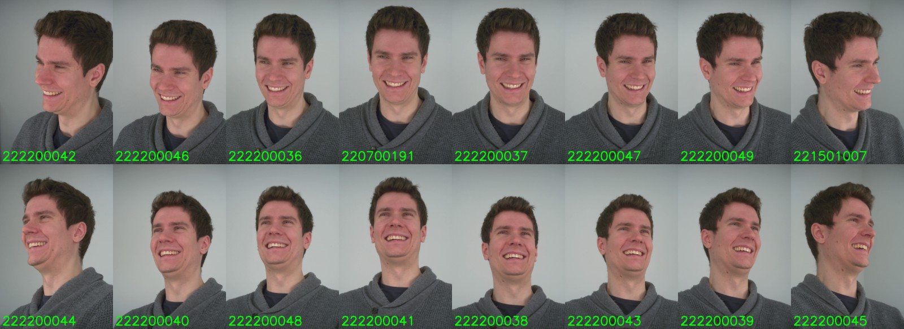

# NeRSemble Dataset v2

[Paper](https://arxiv.org/pdf/2305.03027.pdf) | [Video](https://youtu.be/a-OAWqBzldU) | [Project Page](https://tobias-kirschstein.github.io/nersemble/)

<!-- TODO: Links to benchmark -->

This is the official download repository for v2 of the NeRSemble dataset.
The NeRSemble Dataset is a large-scale multi-view video dataset of facial performances.


# 1. Overview

## Participant Overview


## Camera Overview



## Expression Overview


## Statistics


# 2. Data Access & Setup
1. Request access to the NeRSemble dataset: [https://forms.gle/rYRoGNh2ed51TDWX9](https://forms.gle/rYRoGNh2ed51TDWX9)
2. Once approved, you will receive a mail with the download link in the form of 
    ```python
    NERSEMBLE_BENCHMARK_URL = "..."
    ```
3. Create a file at `~/.config/nersemble_data/.env` with following content:
    ```python
    NERSEMBLE_BENCHMARK_URL = "<<<URL YOU GOT WHEN REQUESTING ACCESS TO NERSEMBLE>>>"
    ```
4. Install this repository via `pip install nersemble_data@git+ssh://git@github.com/tobias-kirschstein/nersemble-data.git`
5. Use the download script in this repository to download the parts of the NeRSemble dataset that you need

# 3. Download Scripts

Upon installation of the repository with pip, a `nersemble-data` script is automatically made available that is the main tool for downloading the dataset.  
You can investigate it via:
```shell
nersemble-data --help
```

If for some reason the `nersemble-data` command cannot be found, you can also invoke the script via
```shell
python ./scripts/manage_data.py
```
from the repository root.


## 3.1. Get an Overview

```shell
nersemble-data list
```

Lists all participant IDs that are available for download.

```shell
nersemble-data list --participant $ID
```

Lists all available sequences for participant `$ID`.

## 3.2. Download data

To download the dataset to your local folder `${nersemble_folder}` run:

```shell
nersemble-data download ${nersemble_folder}
```

The script will first summarize all the files to download with an estimate of the total size and ask for confirmation before the actual download happens.  
Since the full dataset is more than 1.5 TB large, the script provides several parameters to download only parts of the dataset.
Use 
```shell
nersemble-data download --help
```
to get a description of each option.  
In principle, the dataset contains `#PARTICIPANTS x #SEQUENCES x #CAMERAS` many videos, and one can select a subset for each dimension to narrow down the download:  
 - `--participant`: select participant(s) to download
 - `--sequence`: select sequence(s) to download
 - `--camera`: select camera(s) to download
 - `--n_workers` Specify how many download should happen in parallel

For example, 
```shell
nersemble-data download ${nersemble_folder} --participant 240
``` 
downloads all videos for participant `240`, while 
```shell
nersemble-data download ${nersemble_folder} --sequence EMO-1-shout+laugh --camera 222200037
```
would download all participants but only the `222200037` camera for the `EMO-1-shout+laugh` sequence.

# 4. Usage

The repository also comes with a data manager to facilitate loading single images from the downloaded videos:

```python
from nersemble_data.data.nersemble_data import NeRSembleDataManager, NeRSembleParticipantDataManager

nersemble_folder = "path/to/local/nersemble/folder"
data_folder = NeRSembleDataManager(nersemble_folder)
downloaded_participant_ids = data_folder.list_participants()    # <- List of all participants that were downloaded
participant_id = downloaded_participant_ids[0]                  # <- Use first available participant

data_manager = NeRSembleParticipantDataManager(nersemble_folder, participant_id)
downloaded_sequences = data_manager.list_sequences()            # <- List of all sequences that were downloaded for that participant
sequence_name = downloaded_sequences[0]                         # <- Use first available sequence

downloaded_cameras = data_manager.list_cameras(sequence_name)   # <- List of all cameras that were downloaded for that sequence
serial = downloaded_cameras[0]                                  # <- Use first available camera
```

## 4.1. Load images

```python
timestep = 0    # <- Load first frame of video                                                                                   
image = data_manager.load_image(sequence_name, serial, timestep)
```

## 4.2. Load cameras

```python 
camera_calibration = data_manager.load_camera_calibration()
world_2_cam_poses = camera_calibration.world_2_cam  # <- For each camera: 4x4 Extrinsic matrices in W2C direction and OpenCV camera coordinate convention
intrinsics = camera_calibration.intrinsics          # <- 3x3 intrinsic matrix (shared across all 16 cameras) for 3208x2200 images
```

## 4.3. Color Calibration

The v2 of the NeRSemble dataset comes with improved color calibration that improves color consistency across all 16 cameras as well as ensures colors are more realistic in general.  
One can apply color calibration already during image loading:
```python
timestep = 0    # <- Load first frame of video                                                                                   
image = data_manager.load_image(sequence_name, serial, timestep, apply_color_correction=True)
```

Alternatively, one can load the color correction matrix and apply it to the original image separately:
```python
from nersemble_data.util.color_correction import correct_color

color_calibration = data_manager.load_color_calibration()
ccm = color_calibration[serial]
image_corrected = correct_color(image, ccm)
```

<hr />
When using the NeRSemble dataset, please cite the original SIGGRAPH paper:

```bibtex
@article{kirschstein2023nersemble,
    author = {Kirschstein, Tobias and Qian, Shenhan and Giebenhain, Simon and Walter, Tim and Nie\ss{}ner, Matthias},
    title = {NeRSemble: Multi-View Radiance Field Reconstruction of Human Heads},
    year = {2023},
    issue_date = {August 2023},
    publisher = {Association for Computing Machinery},
    address = {New York, NY, USA},
    volume = {42},
    number = {4},
    issn = {0730-0301},
    url = {https://doi.org/10.1145/3592455},
    doi = {10.1145/3592455},
    journal = {ACM Trans. Graph.},
    month = {jul},
    articleno = {161},
    numpages = {14},
}
```
Contact [Tobias Kirschstein](mailto:tobias.kirschstein@tum.de) for questions, comments and reporting bugs, or open a GitHub issue.